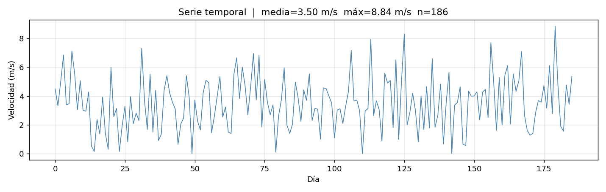
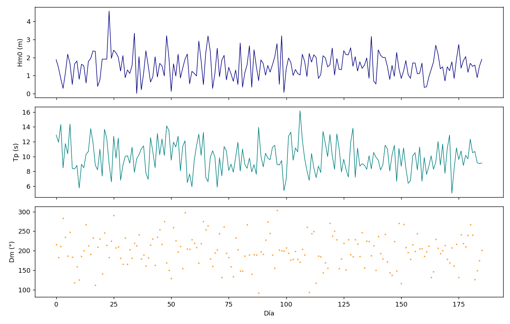
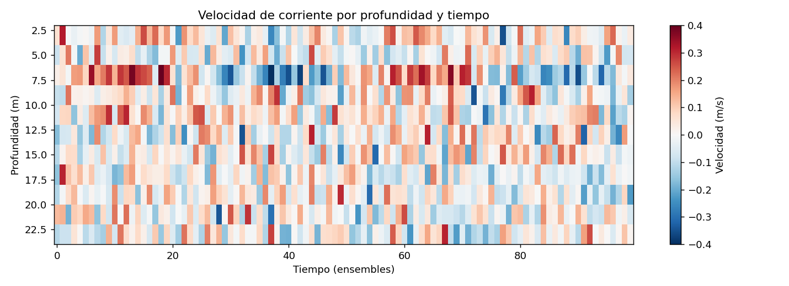
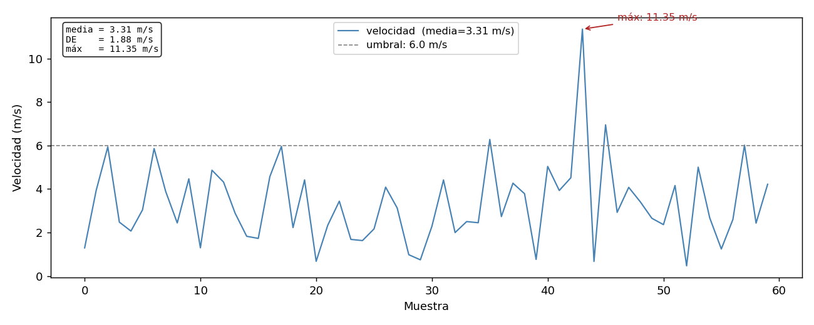

# Matplotlib

Matplotlib es la librería de visualización estándar en Python. Permite crear desde gráficos simples hasta figuras multipanel complejas listas para publicación.

```python
import matplotlib.pyplot as plt
import numpy as np
```

## Gráfico básico

```python
tiempo = np.arange(0, 186)
velocidad = np.random.normal(3.93, 2.8, 186)

plt.figure(figsize=(12, 4))
plt.plot(tiempo, velocidad, color='steelblue', linewidth=0.8)
plt.xlabel('Día')
plt.ylabel('Velocidad (m/s)')
plt.title('Serie temporal de velocidad del viento')
plt.tight_layout()
plt.savefig('serie_viento.png', dpi=150)
plt.show()
```



## Figure y Axes — la estructura correcta

Para figuras con múltiples paneles o más control, se trabaja directamente con objetos `Figure` y `Axes`:

```python
fig, ax = plt.subplots(figsize=(12, 4))

ax.plot(tiempo, velocidad, color='steelblue', linewidth=0.8)
ax.set_xlabel('Día')
ax.set_ylabel('Velocidad (m/s)')
ax.set_title('Serie temporal')
ax.grid(True, alpha=0.3)

fig.tight_layout()
fig.savefig('serie_viento.png', dpi=150)
```

## Múltiples paneles

### subplot simple

```python
fig, axes = plt.subplots(3, 1, figsize=(12, 10), sharex=True)

axes[0].plot(tiempo, Hm0, color='navy')
axes[0].set_ylabel('Hm0 (m)')

axes[1].plot(tiempo, Tm, color='teal')
axes[1].set_ylabel('Tm (s)')

axes[2].plot(tiempo, Dm, color='darkorange', marker='.', markersize=1, linestyle='none')
axes[2].set_ylabel('Dm (°)')
axes[2].set_xlabel('Tiempo')

fig.tight_layout()
```



### subplot2grid — paneles de distinto tamaño

```python
fig = plt.figure(figsize=(14, 8))

ax1 = plt.subplot2grid((2, 3), (0, 0), colspan=2)   # fila 0, cols 0-1
ax2 = plt.subplot2grid((2, 3), (0, 2))               # fila 0, col 2
ax3 = plt.subplot2grid((2, 3), (1, 0), colspan=3)   # fila 1, ancho completo
```

## Tipos de gráfico

```python
# Línea
ax.plot(x, y, color='steelblue', linewidth=1, linestyle='--', label='velocidad')

# Puntos
ax.scatter(x, y, c=colores, s=20, alpha=0.5, cmap='viridis')

# Barras
ax.bar(meses, promedios, color='teal', edgecolor='white')

# Histograma
ax.hist(velocidad, bins=20, color='steelblue', edgecolor='white', density=True)

# Área rellena
ax.fill_between(tiempo, y_min, y_max, alpha=0.3, color='steelblue')

# Línea horizontal / vertical de referencia
ax.axhline(y=6, color='red', linestyle='--', linewidth=0.8, label='umbral')
ax.axvline(x=45, color='gray', linestyle=':')
```

## Colores y estilos

```python
# Colores nombrados
'steelblue', 'navy', 'teal', 'darkorange', 'firebrick', 'gray'

# Hex
'#2196F3'

# Escala de grises
'0.5'   # gris medio

# Transparencia
ax.plot(x, y, color='steelblue', alpha=0.7)

# Colormaps — para datos continuos
cmap = plt.cm.viridis
cmap = plt.cm.RdBu_r   # divergente, útil para anomalías
```

## Ejes y etiquetas

```python
ax.set_xlim(0, 186)
ax.set_ylim(0, 20)

# Ticks personalizados
ax.set_xticks([0, 30, 60, 90, 120, 150, 180])
ax.set_xticklabels(['sep', 'oct', 'nov', 'dic', 'ene', 'feb', 'mar'])
ax.tick_params(axis='x', rotation=45)

# Formato de números en eje
from matplotlib.ticker import PercentFormatter
ax.yaxis.set_major_formatter(PercentFormatter(decimals=1))

# Escala logarítmica
ax.set_yscale('log')
```

## Leyenda y anotaciones

```python
ax.plot(x, y1, label='Velocidad media')
ax.plot(x, y2, label='Percentil 95')
ax.legend(loc='upper right', fontsize=9)

# Anotación de texto
ax.text(0.02, 0.95, f'Máximo: {vmax:.2f} m/s',
        transform=ax.transAxes,   # coordenadas relativas al axes (0-1)
        fontsize=9, verticalalignment='top')

# Flecha con texto
ax.annotate('Evento energético', xy=(45, 3.0), xytext=(60, 3.5),
            arrowprops=dict(arrowstyle='->', color='red'))
```

## Mapas de calor (heatmap)

Muy usado en corrientes para visualizar velocidad por tiempo y profundidad:

```python
# datos: matriz (n_tiempos × n_profundidades)
im = ax.pcolormesh(tiempos, profundidades, datos.T,
                   cmap='RdBu_r', vmin=-0.3, vmax=0.3)
fig.colorbar(im, ax=ax, label='Velocidad (m/s)')
ax.set_ylabel('Profundidad (m)')
ax.invert_yaxis()   # profundidad creciente hacia abajo
```



## Guardar figuras

```python
fig.savefig('figura.png', dpi=150, bbox_inches='tight')
fig.savefig('figura.pdf', bbox_inches='tight')    # vectorial
fig.savefig('figura.svg', bbox_inches='tight')    # vectorial editable

plt.close(fig)   # liberar memoria — importante en scripts que generan muchas figuras
```

### PDF multipágina

```python
from matplotlib.backends.backend_pdf import PdfPages

with PdfPages('informe_figuras.pdf') as pdf:
    for mes in meses:
        fig, ax = plt.subplots()
        ax.plot(datos_mes[mes])
        ax.set_title(mes)
        pdf.savefig(fig)
        plt.close(fig)
```

## Figuras con valores calculados

En análisis real, los títulos, etiquetas y leyendas deben mostrar valores del propio conjunto de datos — no texto fijo. Así la figura se documenta a sí misma.



### Título y subtítulo con estadísticas

```python
import matplotlib.pyplot as plt
import numpy as np

velocidad = np.array([1.2, 3.4, 2.1, 4.5, 0.8, 3.9, 2.7])

fig, ax = plt.subplots(figsize=(10, 4))
ax.plot(velocidad, color='steelblue', linewidth=1.2)

# Calcular estadísticas para usar en el título
v_media = velocidad.mean()
v_max   = velocidad.max()
n       = len(velocidad)

ax.set_title(f'Serie temporal de velocidad  |  media={v_media:.2f} m/s  máx={v_max:.2f} m/s  n={n}')
ax.set_xlabel('Muestra')
ax.set_ylabel('Velocidad (m/s)')
fig.tight_layout()
```

### Leyendas con valores calculados

```python
profundidades = [5, 10, 20]
datos = {
    5:  np.random.normal(2.5, 0.8, 186),
    10: np.random.normal(1.8, 0.6, 186),
    20: np.random.normal(0.9, 0.4, 186),
}

fig, ax = plt.subplots(figsize=(12, 4))

for prof, serie in datos.items():
    media = serie.mean()
    # La etiqueta de la leyenda incluye el valor calculado
    ax.plot(serie, label=f'{prof} m  (media={media:.2f} m/s)', linewidth=0.8)

ax.set_xlabel('Tiempo (días)')
ax.set_ylabel('Velocidad (m/s)')
ax.legend(loc='upper right', fontsize=9)
fig.tight_layout()
```

### Anotaciones sobre el gráfico

```python
fig, ax = plt.subplots(figsize=(10, 4))
ax.plot(velocidad, color='steelblue', linewidth=1.2)

# Marcar el máximo con una anotación
idx_max = velocidad.argmax()
v_max   = velocidad[idx_max]

ax.annotate(
    f'máx: {v_max:.2f} m/s',
    xy=(idx_max, v_max),           # punto al que apunta la flecha
    xytext=(idx_max + 0.5, v_max + 0.3),  # posición del texto
    arrowprops=dict(arrowstyle='->', color='firebrick'),
    fontsize=9, color='firebrick'
)

# Línea de referencia con su propio label
umbral = 3.0
ax.axhline(umbral, color='gray', linestyle='--', linewidth=0.8,
           label=f'umbral operacional: {umbral} m/s')
ax.legend(fontsize=9)
fig.tight_layout()
```

### Texto estadístico dentro del panel

```python
fig, ax = plt.subplots(figsize=(10, 4))
ax.plot(velocidad, color='steelblue')

# Bloque de estadísticas en esquina del axes
stats_texto = (
    f"media = {velocidad.mean():.2f} m/s\n"
    f"DE    = {velocidad.std():.2f} m/s\n"
    f"máx   = {velocidad.max():.2f} m/s\n"
    f"n     = {len(velocidad)}"
)
ax.text(
    0.02, 0.97, stats_texto,
    transform=ax.transAxes,       # coordenadas 0-1 relativas al panel
    fontsize=8, verticalalignment='top',
    fontfamily='monospace',
    bbox=dict(boxstyle='round', facecolor='white', alpha=0.8)
)
fig.tight_layout()
```

### Título desde metadatos del archivo

```python
import pandas as pd

df = pd.read_csv('corrientes_oct2025.csv', parse_dates=['fecha'])

fecha_ini = df['fecha'].min().strftime('%d %b %Y')
fecha_fin = df['fecha'].max().strftime('%d %b %Y')
n_dias    = (df['fecha'].max() - df['fecha'].min()).days

fig, ax = plt.subplots(figsize=(12, 4))
ax.plot(df['fecha'], df['velocidad'], linewidth=0.8)
ax.set_title(f'Velocidad de corriente — {fecha_ini} al {fecha_fin} ({n_dias} días)')
ax.set_xlabel('Fecha')
ax.set_ylabel('Velocidad (m/s)')
fig.autofmt_xdate()   # rota etiquetas de fecha automáticamente
fig.tight_layout()
```

## Backend gráfico

El backend controla cómo se muestran las figuras:

```python
import matplotlib
matplotlib.use('Qt5Agg')   # ventana interactiva (ideal en Spyder)
# o
matplotlib.use('Agg')      # sin ventana, solo guardar a archivo (ideal en scripts automáticos)
```

En Spyder se configura desde **Preferences → IPython console → Graphics → Backend**.

!!! tip "plt.close() en scripts automáticos"
    Cuando un script genera decenas de figuras (como el autoinforme), es importante cerrar cada figura después de guardarla con `plt.close(fig)`. De lo contrario Matplotlib acumula todas en memoria y Spyder puede volverse lento o colapsar.
