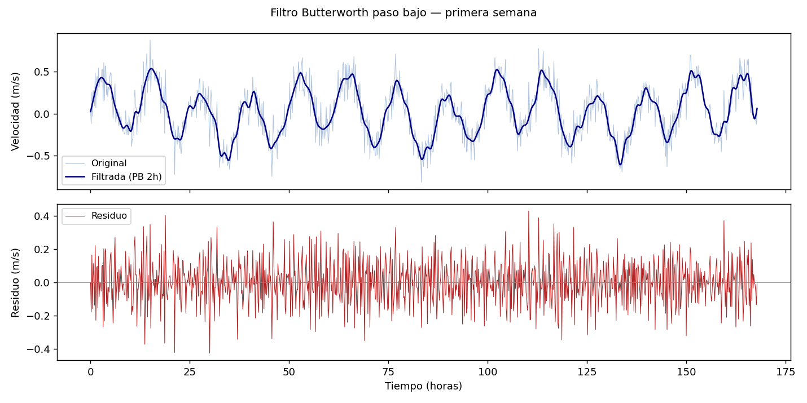

# Filtros e interpolación

Los datos oceanográficos rara vez llegan limpios: tienen ruido de alta frecuencia, datos faltantes (NaN) y resolución temporal variable. El filtrado elimina frecuencias no deseadas; la interpolación rellena huecos; el remuestreo homogeneiza la resolución temporal. Estas tres operaciones son parte estándar de cualquier pipeline de preprocesamiento.

## Media móvil (filtro de paso bajo simple)

Es el filtro más sencillo y el más rápido de aplicar con pandas:

```python
import pandas as pd

# Ventana de 1 hora en datos de 10 min → 6 muestras
df['vel_suavizada'] = df['velocidad'].rolling(window=6, center=True).mean()

# Con mínimo de datos para no producir NaN en los extremos
df['vel_suavizada'] = df['velocidad'].rolling(window=6, center=True, min_periods=3).mean()
```

La media móvil atenúa bien el ruido pero tiene una respuesta de frecuencia imperfecta: no rechaza completamente las frecuencias altas y tiene fugas. Para filtrado más preciso se usa Butterworth.

## Filtro Butterworth (scipy)

El filtro Butterworth tiene una respuesta plana en la banda de paso y cae abruptamente en la banda de rechazo:

```python
from scipy.signal import butter, filtfilt
import numpy as np

def filtro_paso_bajo(serie, fs_hz, fc_hz, orden=4):
    """
    Aplica filtro Butterworth de paso bajo.

    fs_hz : frecuencia de muestreo (Hz)
    fc_hz : frecuencia de corte (Hz)
    """
    nyq = fs_hz / 2
    wn  = fc_hz / nyq   # frecuencia de corte normalizada [0, 1]
    b, a = butter(orden, wn, btype='low')
    return filtfilt(b, a, serie)   # filtfilt: sin desfase de fase

# Datos cada 10 min → fs = 1/600 Hz
fs = 1 / 600

# Cortar periodos menores a 2 horas → fc = 1/(2*3600) Hz
fc = 1 / (2 * 3600)

vel_filtrada = filtro_paso_bajo(df['velocidad'].dropna().values, fs, fc)
```

### Filtro de paso alto (eliminar marea)

Para separar la corriente residual (sin marea) de la señal total:

```python
def filtro_paso_alto(serie, fs_hz, fc_hz, orden=4):
    nyq = fs_hz / 2
    wn  = fc_hz / nyq
    b, a = butter(orden, wn, btype='high')
    return filtfilt(b, a, serie)

# Eliminar componentes con período mayor a 30 horas
fc_alta = 1 / (30 * 3600)
vel_residual = filtro_paso_alto(df['velocidad'].dropna().values, fs, fc_alta)
```

### Filtro de banda (aislar marea semidiurna)

```python
def filtro_banda(serie, fs_hz, fc_low_hz, fc_high_hz, orden=4):
    nyq = fs_hz / 2
    wn  = [fc_low_hz / nyq, fc_high_hz / nyq]
    b, a = butter(orden, wn, btype='band')
    return filtfilt(b, a, serie)

# Aislar M2: banda 11–14 horas de período
fc_low  = 1 / (14 * 3600)
fc_high = 1 / (11 * 3600)
marea_M2 = filtro_banda(df['velocidad'].dropna().values, fs, fc_low, fc_high)
```



## Interpolación de NaN

### Interpolación lineal con pandas

```python
# Interpolar NaN por interpolación lineal (por defecto)
df['vel_interp'] = df['velocidad'].interpolate(method='linear')

# Limitar la cantidad de NaN consecutivos a rellenar
df['vel_interp'] = df['velocidad'].interpolate(method='linear', limit=3)

# Interpolar también en los extremos (por defecto pandas no interpola bordes)
df['vel_interp'] = df['velocidad'].interpolate(method='linear',
                                                limit_direction='both')
```

### Interpolación cúbica con scipy

Para series con huecos pequeños donde se quiere una curva más suave:

```python
from scipy.interpolate import interp1d

# Separar datos válidos de NaN
mascara_valida = df['velocidad'].notna()
t_valido = df.index[mascara_valida].astype(np.int64)   # timestamps como enteros
v_valido = df['velocidad'][mascara_valida].values

# Construir interpolador
f_interp = interp1d(t_valido, v_valido, kind='cubic',
                    bounds_error=False, fill_value='extrapolate')

# Aplicar a todos los tiempos
t_todos = df.index.astype(np.int64)
df['vel_cubica'] = f_interp(t_todos)
```

## Remuestreo temporal

### Reducir resolución (downsampling)

```python
# Datos cada 10 min → promedios horarios
df_horario = df.resample('1h').mean()

# Estadísticas adicionales al remuestrear
df_hora = df.resample('1h').agg({
    'velocidad': ['mean', 'max', 'std'],
    'direccion': 'mean'   # ojo: dirección requiere media circular
})
df_hora.columns = ['vel_media', 'vel_max', 'vel_std', 'dir_media']
```

### Aumentar resolución (upsampling)

```python
# Datos horarios → cada 10 minutos por interpolación lineal
df_10min = df_horario.resample('10min').interpolate(method='linear')
```

### Alinear dos series con distinta resolución

```python
# Serie A: cada 10 min    Serie B: cada 1 hora
# Remuestrear B a 10 min para comparar punto a punto
df_B_10min = df_B.resample('10min').interpolate(method='linear')

# Alinear por índice de tiempo (inner join)
df_conjunto = df_A.join(df_B_10min, how='inner', rsuffix='_B')
```

## Detección y eliminación de spikes

Un filtro de desviación estándar elimina valores atípicos aislados:

```python
def eliminar_spikes(serie, ventana=20, umbral_std=3.0):
    """
    Reemplaza por NaN los valores que se alejan más de umbral_std
    desviaciones estándar de la media móvil local.
    """
    media_local = serie.rolling(ventana, center=True, min_periods=5).mean()
    std_local   = serie.rolling(ventana, center=True, min_periods=5).std()
    mascara_spike = np.abs(serie - media_local) > umbral_std * std_local
    serie_limpia = serie.copy()
    serie_limpia[mascara_spike] = np.nan
    n_spikes = mascara_spike.sum()
    print(f"  Spikes eliminados: {n_spikes} ({n_spikes/len(serie)*100:.1f}%)")
    return serie_limpia

df['vel_limpia'] = eliminar_spikes(df['velocidad'])
```

## Comparar señal original y filtrada

```python
import matplotlib.pyplot as plt
import matplotlib.dates as mdates

fig, axes = plt.subplots(2, 1, figsize=(14, 7), sharex=True)

axes[0].plot(df.index, df['velocidad'], color='lightsteelblue',
             linewidth=0.5, label='Original')
axes[0].plot(df.index[mascara_valida], vel_filtrada, color='navy',
             linewidth=1.0, label='Filtrada (PB 2h)')
axes[0].set_ylabel('Velocidad (m/s)')
axes[0].legend()

axes[1].plot(df.index, df['velocidad'] - df['vel_suavizada'],
             color='firebrick', linewidth=0.5, label='Residuo (original − suavizada)')
axes[1].axhline(0, color='gray', linewidth=0.5)
axes[1].set_ylabel('Residuo (m/s)')
axes[1].legend()

axes[1].xaxis.set_major_formatter(mdates.DateFormatter('%d %b'))
fig.tight_layout()
```

!!! tip "filtfilt vs. lfilter"
    `filtfilt` aplica el filtro dos veces (ida y vuelta) para cancelar el desfase de fase. Esto es importante en oceanografía: un desfase introduciría un error temporal en los picos de marea o corriente. Usar siempre `filtfilt` salvo que se necesite causalidad estricta.

!!! warning "NaN antes de filtrar"
    `butter` + `filtfilt` no toleran NaN en la serie. Siempre interpolar o eliminar los NaN antes de aplicar el filtro, y luego reponer los NaN en las posiciones originales si se quiere conservar la información de huecos.
